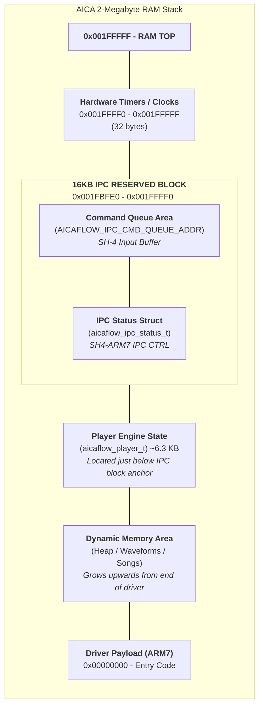

# AICA Flow (AFX) Sequencer

A high-performance, low-overhead MIDI-to-AICA sequencer for the SEGA Dreamcast. This project enables streaming complex musical arrangements to the AICA SPU with minimal ARM7 CPU intervention by pre-computing hardware register opcodes on the host side.

The current `.afx` format is v2-only. The toolchain emits a self-contained file with a sample blob, per-sample descriptors, an opcode stream, and optional DSP payloads.

## Project Architecture

The system is split into four main pieces:

1. **Host Tools (`tools/`)**: built binaries for `midi2afx` and `afx_info`, plus the helper script `generate_wavetable_map.py`.
2. **Host Tool Sources (`src/tools/`)**: C23 utilities that pack samples, convert MIDI to `.afx`, and inspect `.afx` output.
3. **ARM7 Driver (`src/driver/aica_driver.c`)**: a freestanding C99 driver that runs on the AICA ARM7DI and streams timestamped register writes.
4. **SH4 Host API (`src/driver/aica_host_api.c`)**: a small control layer for play, stop, pause, volume, and seek IPC.

## Key Features

- **Integrated Wavetable Synthesis**: Automatically scans a user-defined directory (e.g., "Echo Sound Works Core Tables") to map MIDI Program Change messages to high-quality PCM samples.
- **Absolute Time Sequencing**: All MIDI events are pre-calculated into 1 ms absolute timestamps, including tempo changes across multiple tracks.
- **Descriptor-Based Sample Packing**: The compiler emits per-sample metadata including format, loop mode, root note, loop points, and sample rate.
- **Seekable Playback**: The ARM7 driver supports binary-search seek by target tick through IPC.
- **Global Music Volume**: Runtime volume scaling is applied only to `TOT_LVL` writes; all other opcodes remain precomputed.
- **Optional DSP Payloads**: `.afx` files can carry DSP coefficient and microprogram sections that are uploaded on song start.
- **Test Coverage**: `make test` runs unit tests plus an end-to-end integration path that generates and inspects a real `.afx` file.

## File Format (.afx)

| Section | Description |
| :--- | :--- |
| **Header (`afx_header_t`)** | v2 header with offsets, sizes/counts, and total song duration in ms. |
| **Sample Data Blob** | Raw ADPCM or PCM sample bytes packed back-to-back. |
| **Sample Descriptor Table** | Array of `afx_sample_desc_t` entries with source ID, GM program, format, loop info, root note, sample rate, and offsets. |
| **Opcode Stream** | Array of `afx_opcode_t` entries: timestamp, slot, register, value. |
| **DSP MPRO / COEF** | Optional embedded DSP microprogram and coefficient payloads. |

Relevant v2 properties:

- `AICAF_MAGIC = 0xA1CAF200`
- `AICAF_VERSION = 2`
- `stream_data_size` is an opcode count, not a byte size
- sample addresses in the stream are blob-local offsets; the ARM7 driver adds the sample-data base at playback time

## Build Instructions

Requirements:
- A modern C23-compliant host compiler (GCC 13+ or Clang 17+).
- `arm-none-eabi-gcc` for the SPU driver.
- KallistiOS (KOS) environment for SH4 components.

To build the entire project:
```bash
make all
```

Individual components:
- `make tools`: Build `midi2afx` and `afx_info`.
- `make driver`: Build the ARM7 binary (`src/driver/aica_driver.bin`).
- `make test`: Run unit and integration tests.

## Usage

Generate or refresh the wavetable map from the default input collection:

```bash
python3 ./tools/generate_wavetable_map.py
```

By default this scans `input/wavetable_collections` and writes `input/wavetables.map`.

Convert a MIDI file to the AFX format:
```bash
./tools/midi2afx input/bwv1007.mid output.afx input/wavetables.map
```

Useful options:

- `--trim`: trim trailing silence and clamp long samples before packing
- `--16bit`: store PCM16 instead of ADPCM

Inspect an AFX file:
```bash
./tools/afx_info output.afx input/wavetables.map
```

Run the Python emulator against a generated file:

```bash
python3 ./tools/afx_emulator.py output.afx input/wavetables.map render.wav
```

Run the full test suite:

```bash
make test
```

Test artifacts are written under `tests/artifacts/`.

## Runtime Control

The SH4/ARM7 IPC interface currently supports:

- `PLAY`
- `STOP`
- `PAUSE`
- `VOLUME`
- `SEEK`

The ARM7 driver remains intentionally simple: it advances a virtual clock, streams register writes, uploads optional DSP data at song start, and applies only one runtime transform to the stream: global total-level scaling for music volume.

## Memory Map (SPU RAM)


