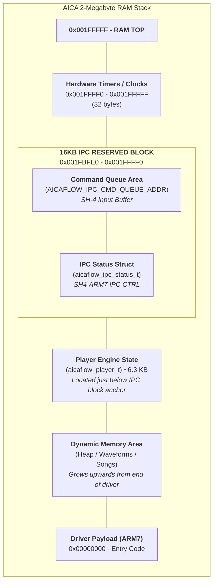

# AICA Flow (AFX) Sequencer

A high-performance, low-overhead MIDI-to-AICA sequencer for the SEGA Dreamcast. This project enables streaming complex musical arrangements to the AICA SPU with minimal ARM7 CPU intervention by pre-computing hardware register opcodes on the host side.

## Project Architecture

The system is split into three main layers:

1.  **Host Tools (`/tools`)**: C23-based utilities that convert Standard MIDI files into the optimized `.aicaflow` binary format.
2.  **ARM7 Driver (`src/driver/aica_driver.c`)**: A zero-stack, C99 driver that runs on the SPU’s ARM7DI processor, interpreting the opcode stream and managing playback.
3.  **SH4 Host API (`src/driver/aica_host_api.c`)**: A minimalist C API for KallistiOS (KOS) to load songs, control playback (Play/Stop/Pause/Volume), and manage the IPC interface.

## Key Features

- **Integrated Wavetable Synthesis**: Automatically scans a user-defined directory (e.g., "Echo Sound Works Core Tables") to map MIDI Program Change messages to high-quality PCM samples.
- **Absolute Time Sequencing**: All MIDI events are pre-calculated into 1ms-resolution absolute timestamps (supporting multiple tracks and tempo changes).
- **Virtual Clock Management**: Supports seeking (forward/reverse) by exposing a mutable virtual clock in SPU RAM.
- **Zero-Stack Driver**: The ARM7 driver is designed to run in high-performance bare-metal environments using absolute memory mappings for stability and speed.
- **Dynamic ADSR Control**: Maps MIDI CC 72 (Release) and CC 73 (Attack) through to AICA hardware envelope registers in real-time.

## File Format (.aicaflow)

| Section | Description |
| :--- | :--- |
| **Header (`afx_header_t`)** | Contains offsets, sizes, and song duration in ms. |
| **Sample Bank** | Concatenated raw PCM samples aligned for the AICA Wave RAM. |
| **Opcode Stream** | Array of `afx_opcode_t` (Timestamp, Slot, Register, Value). |

## Build Instructions

Requirements:
- A modern C23-compliant host compiler (GCC 13+ or Clang 17+).
- `arm-none-eabi-gcc` for the SPU driver.
- KallistiOS (KOS) environment for SH4 components.

To build the entire project:
```bash
make all
```

Individual components:
- `make tools`: Build `midi2aicaflow` and `afx_info`.
- `make driver`: Build the `driver.arm` binary.

## Usage

Convert a MIDI file to the AFX format:
```bash
./tools/midi2aicaflow output.aicaflow input.mid /path/to/wav/samples/
```

Inspect an AFX file:
```bash
./tools/afx_info output.aicaflow
```

## Memory Map (SPU RAM)


