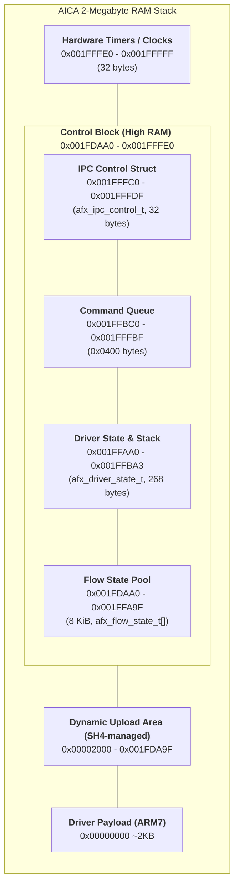

# .afx Format Design

## Core Philosophy

The ARM7 driver is a dumb stream player.
It does not do instrument logic, sample lookup, or synthesis decisions.

Driver responsibilities:
1. Advance virtual clock
2. When `virtual_clock >= flow_cmd.timestamp`, write `flow_cmd.value` to the target AICA register
3. Process SH4->ARM7 control commands from IPC queue

Host tool (`midi2afx`) responsibilities:
- Parse MIDI and resolve musical intent
- Select/pack samples and descriptors
- Encode AICA register command stream
- Bake per-note and per-voice decisions into flow commands

The result is a flow-command architecture where the runtime is deterministic and lightweight.

---


## Driver Memory Map (SPU RAM)

Current layout constants (from `include/afx/common.h` and `driver.h`):

- `AFX_MEM_CLOCKS = 0x001FFFE0`
- `AFX_IPC_CONTROL_ADDR = 0x001FFFC0` (`sizeof(afx_ipc_control_t)=32`, aligned)
- `AFX_IPC_CMD_QUEUE_ADDR = 0x001FFBC0` (`AFX_IPC_QUEUE_SZ=0x0400`)
- `AFX_DRIVER_STATE_ADDR = 0x001FFAA0` (`sizeof(afx_driver_state_t)=268`, aligned down to 32-byte boundary)
- `AFX_FLOW_POOL_START = 0x001FDAA0` (8 KiB pool for `afx_flow_state_t` instances, aligned)

Addresses are derived by macros, not hardcoded constants:
- `AFX_IPC_CONTROL_ADDR = ((AFX_MEM_CLOCKS - sizeof(afx_ipc_control_t)) & ~31)`
- `AFX_IPC_CMD_QUEUE_ADDR = (AFX_IPC_CONTROL_ADDR - AFX_IPC_QUEUE_SZ)`
- `AFX_DRIVER_STATE_ADDR = ((AFX_IPC_CMD_QUEUE_ADDR - sizeof(afx_driver_state_t)) & ~31)`
- `AFX_FLOW_POOL_START = ((AFX_DRIVER_STATE_ADDR - 8192) & ~31)`

The SH4 side owns dynamic allocation in low/mid SPU RAM and uploads full `.afx` files. The ARM7 driver reads the uploaded header in-place and maintains runtime state in `afx_driver_state_t` at a fixed high-memory address. This struct includes a small reserved stack for the ARM7 compiler to use for local variables and spills, protected by a 32-bit canary.




## Binary Layout

```
[afx_header_t]             - 20-byte lean header
[afx_section_entry_t[]]    - implicit directory table (immediately follows header)
[FLOW]                     - array of afx_cmd_t
[SDES]                     - array of afx_sample_desc_t
[META]                     - optional afx_meta_t metadata block
[SDAT]                     - raw ADPCM/PCM bytes
```

All section offsets are relative to file start.

---

## Data Structures (Current)

### Header (`afx_header_t`)

```c
#define AICAF_MAGIC    0xA1CAF100
#define AICAF_VERSION  1

typedef struct {
    uint32_t magic;
    uint32_t version;
    uint32_t section_count;
    uint32_t total_ticks;      // total duration in ms
    uint32_t flags;            // AFX_FILE_FLAG_*
} afx_header_t;

/* Section table immediately follows header at offset 20 */
typedef struct {
    uint32_t id;               // AFX_SECT_* fourcc
    uint32_t offset;           // file-relative byte offset
    uint32_t size;             // bytes
    uint32_t count;            // entry count for array sections
    uint32_t align;            // alignment (4 or 32)
    uint32_t flags;
} afx_section_entry_t;
```

**File-level flags:**

| Flag | Value | Meaning |
|------|-------|---------|
| `AFX_FILE_FLAG_EXTERNAL_SAMPLE_ADDRS` | `0x00000001` | FLOW commands embed **absolute SPU addresses** for samples uploaded separately via `afx_sample_upload()`, not file-relative offsets. Used when samples are managed independently of the `.afx` blob (e.g. pre-uploaded SFX reused across multiple flows). |

### Sample Descriptor (`afx_sample_desc_t`)

```c
#define AFX_FMT_PCM16  0
#define AFX_FMT_PCM8   1
#define AFX_FMT_ADPCM  3

#define AFX_LOOP_NONE  0
#define AFX_LOOP_FWD   1
#define AFX_LOOP_BIDIR 2

typedef struct {
    uint32_t source_id;
    uint8_t  gm_program;
    uint8_t  format;
    uint8_t  loop_mode;
    uint8_t  root_note;
    int8_t   fine_tune;
    uint8_t  reserved[3];
    uint32_t sample_off;   // byte offset into sample blob
    uint32_t sample_size;  // bytes
    uint32_t loop_start;   // byte offset relative to sample_off
    uint32_t loop_end;     // byte offset relative to sample_off
    uint32_t sample_rate;
} afx_sample_desc_t;
```

### Metadata (`afx_meta_t`)

```c
typedef struct {
    uint32_t version;
    uint32_t required_channels;
    uint32_t reserved[2];
} afx_meta_t;
```

Current use:
- `required_channels`: peak AICA channels needed for song playback. The driver reserves this many channels for the flow and maps flow-local slot offsets onto that reserved set.
- This allows runtime systems to reserve only the channels required by music, leaving the remainder available for sound effects or other flows.

### Flow Command Entry (`afx_cmd_t`)

AFX uses a variable-length command structure to support burst writes to consecutive AICA registers.

```c
typedef struct {
    uint32_t timestamp;     /* Absolute time in ms */
    struct {
        uint16_t slot : 6;    /* Flow-local channel index (0-63) */
        uint16_t offset : 5;  /* Half-word index into aica_chnl_packed_t (0-31) */
        uint16_t length : 5;  /* Number of consecutive 16-bit values to write (1-31) */
    };
    uint16_t values[];      /* Payload: length * 2 bytes */
} afx_cmd_t;
```

**Memory Layout:**
- **Header**: 6 bytes (4 bytes timestamp + 2 bytes packed metadata).
- **Payload**: `length * 2` bytes.
- **Alignment**: Every command is padded to a **4-byte boundary**. If `length` is odd (1, 3, 5...), 2 bytes of zero padding follow the payload.

**Example: Note-On Burst (22 bytes total)**
- `timestamp`: Current time
- `slot`: flow-local channel index
- `offset`: 0 (`play_ctrl` half-word index)
- `length`: 10 (spanning `play_ctrl` through `pan`)
- `values`: [play_ctrl, sa_low, lsa, lea, env_ad, env_dr, pitch, lfo, env_fm, pan]
- *No padding needed (10 is even).*

**Example: Volume Update (10 bytes total)**
- `timestamp`: Current time
- `slot`: flow-local channel index
- `offset`: 8 (`env_fm` half-word index, which contains TL)
- `length`: 1
- `values`: [new_env_fm_value]
- **Padding**: 2 bytes (to reach 4-byte alignment).

---

## AICA Channel Register Layout (`aica_chnl_packed_t`)

Commands use `offset` as a **half-word index** (word index ÷ 2) into `aica_chnl_packed_t`. Writing `length` consecutive half-words starting at `offset` writes that many consecutive channel registers.

| Half-word index | Struct field | Key bits |
|----------------|--------------|----------|
| 0 | `play_ctrl` | `key_on`, `key_on_ex`, `sa_high[6:0]`, `pcms[1:0]`, `lpctl`, `ssctl` |
| 1 | `sa_low` | Sample address [15:0] |
| 2 | `lsa` | Loop start address **in samples**, relative to sample start |
| 3 | `lea` | Loop end address **in samples**, relative to sample start. Must be `n_samples - 1` for single-shot playback |
| 4 | `env_ad` | `ar[4:0]`, `d1r[4:0]`, `d2r[4:0]` |
| 5 | `env_dr` | `rr[4:0]`, `dl[4:0]`, `krs[3:0]`, `lpslnk` |
| 6 | `pitch` | `fns[9:0]`, `oct[3:0]` (signed octave shift) |
| 7 | `lfo` | `alfos`, `alfows`, `plfos`, `plfows`, `lfof`, `lfore` |
| 8 | `env_fm` | `isel[3:0]`, `tl[7:0]` (Total Level: 0 = max, 255 = mute) |
| 9 | `pan` | `dipan[4:0]`, `disdl[3:0]`, `imxl[3:0]` |

**Important field notes:**

- **`play_ctrl.pcms`**: `0` = 16-bit PCM, `1` = 8-bit PCM, `2` = ADPCM.
- **`play_ctrl.sa_high`**: Upper 7 bits of the absolute SPU sample address (bits [22:16]). `sa_low` holds bits [15:0].
- **`lsa` / `lea`**: Both are **sample counts relative to the sample start address**, not byte offsets. For a non-looping sample: set `lsa = 0`, `lea = n_samples - 1`. Getting `lea = 0` is a common mistake that silences the channel instantly.
- **`env_fm.tl`**: Total Level attenuation. `0` = full volume, `255` = silence.
- **`pan.disdl`**: Direct Send Level to DAC. 4-bit field (0–15). **`0` = channel is not sent to DAC output (silent).** Set to `0xF` (15) for full-level output.
- **`pan.dipan`**: 5-bit panning (0–15 = left-to-center, 16–31 = center-to-right).

---

## Runtime Offset Model

The driver keeps a single base pointer to the uploaded `.afx` file in AICA RAM (`afx_base`).
All offsets emitted by the preprocessor are file-relative and ARM7 resolves them at use time.

### Address Resolution

**Default (file-relative samples, `AFX_FILE_FLAG_EXTERNAL_SAMPLE_ADDRS` not set):**

```c
absolute_spu_addr = afx_base + relative_offset;
```

**External sample addresses (`AFX_FILE_FLAG_EXTERNAL_SAMPLE_ADDRS` set):**

FLOW commands embed the absolute SPU address directly. The driver writes it to the channel registers as-is. Used when samples are uploaded independently ahead of time via `afx_sample_upload()`.

### Runtime Behavior

**Initialization (PLAY time)**:
1. ARM7 stores the file base pointer in flow state (`afx_base`)
2. ARM7 resolves section pointers using `afx_base + section.offset`

**Command Execution**:
- Each command bursts `length` consecutive half-words starting at half-word `offset` into the target channel's register block
- Absolute channel address = AICA channel base + (`offset * 4`) for hardware

### Runtime Fast Path Notes

- `afx_driver_state_t` includes runtime scratch fields used by the ARM7 loop to minimize transient locals in hot paths.
- Queue tail wrap is fixed-size (`AFX_IPC_QUEUE_CAPACITY`), enabling constant-time ring behavior.
- `TOT_LVL` volume scaling is lookup-table based at runtime:
    - a 256-entry TL scale table is rebuilt only when volume changes
    - per-command `TL` writes use direct table lookup (no multiply/divide in the hot write path)

---

## Flow State (`afx_flow_state_t`)

The driver allocates one `afx_flow_state_t` per active flow from `AFX_FLOW_POOL_START`. The SH4 holds the SPU address of each active flow state and uses it to send commands and poll completion.

```c
typedef struct afx_flow_state {
    uint32_t prev_ptr;          // SPU addr of previous flow in active list (0=head)
    uint32_t next_ptr;          // SPU addr of next flow in active list (0=tail)
    uint32_t afx_base;          // Absolute SPU address of uploaded .afx blob
    uint32_t flow_ptr;          // afx_base + FLOW section offset
    uint32_t flow_size;         // FLOW section byte size
    uint32_t flow_count;        // FLOW section entry count
    uint32_t flow_idx;          // Current command index
    uint32_t next_event_tick;   // Timestamp of next pending command
    uint32_t is_playing;        // AFX_FLOW_STOPPED/PLAYING/PAUSED/DRAINING
    uint32_t loop_count;
    uint32_t tl_scale_lut_ptr;  // Optional 256-byte TL LUT (0=disabled)
    uint64_t assigned_channels; // Bitmask of hardware channels assigned to this flow
    uint32_t required_channels;
    uint8_t  channel_map[64];   // File-local slot -> hardware channel index
    uint32_t flags;
} afx_flow_state_t;
```

**Flow lifecycle:**
1. `afx_upload_afx()` → uploads `.afx` blob, returns `song_spu`
2. `afx_create_flow(song_spu)` → allocates `afx_flow_state_t`, returns `flow_spu`
3. `afx_play_flow(flow_spu)` → sends `AICAF_CMD_PLAY_FLOW` to ARM7
4. ARM7 drains commands; when done, sets `is_playing = AFX_FLOW_DRAINING`, waits for HW silence
5. ARM7 writes `completed_flow_addr` / increments `completed_flow_seq` in `afx_ipc_control_t`
6. SH4 polls via `afx_poll_completed_flow()`, then must call:
   - `afx_release_channels(flow_spu)` — returns channels to the pool
   - `afx_free_afx(song_spu)` — frees the `.afx` blob
   - `afx_mem_free(flow_spu, sizeof(afx_flow_state_t))` — frees the flow state

---

## SH4/ARM7 IPC Model

IPC transport is a ring queue in AICA RAM.

### Control block (`afx_ipc_control_t`, 32 bytes)

```c
typedef struct {
    uint32_t magic;                 // AICAF_MAGIC
    uint32_t arm_status;            // 0=Idle, 1=Playing, 3=Error
    uint32_t current_tick;          // Current global playback tick
    uint32_t volume;                // Global music volume (0-255)
    uint32_t q_head;                // SH4 producer index
    uint32_t q_tail;                // ARM7 consumer index
    uint32_t completed_flow_addr;   // SPU addr of most recently completed flow
    uint32_t completed_flow_seq;    // Monotonic completion counter
} afx_ipc_control_t;
```

Queue characteristics:
- fixed-size circular buffer (`AFX_IPC_QUEUE_SZ = 0x0400`)
- SH4 is producer (`q_head`)
- ARM7 is consumer (`q_tail`)
- poll interval ~1ms, with drain-until-empty behavior

### Supported IPC commands

| ID | Name | arg0 | arg1 |
|----|------|------|------|
| 0 | `NONE` | — | — |
| 1 | `PLAY_FLOW` | flow SPU addr | — |
| 2 | `STOP_FLOW` | flow SPU addr | — |
| 3 | `PAUSE_FLOW` | flow SPU addr | — |
| 4 | `RESUME_FLOW` | flow SPU addr | — |
| 5 | `VOLUME` | volume (0–255) | — |
| 6 | `SEEK_FLOW` | flow SPU addr | target tick (ms) |
| 7 | `RETIRE_FLOW` | flow SPU addr | — |

---

## SH4 Dynamic Memory Ownership (Current)

SH4 owns dynamic AICA RAM allocation.

Implemented host helpers:
- `afx_mem_reset`
- `afx_mem_alloc`
- `afx_mem_free`
- `afx_mem_write`
- `afx_upload_afx`
- `afx_free_afx`
- `afx_upload_and_init_firmware`

Sample management:
- `afx_sample_upload(buf, len, rate, bitsize, channels)` → opaque handle
- `afx_sample_free(handle)`
- `afx_sample_get_info(handle, &info)` → fills `afx_sample_info_t` (spu_addr, length, rate, bitsize, channels)

Firmware upload/init behavior:
- upload firmware at SPU address 0x0
- write 32-byte aligned dynamic-base marker immediately after firmware size
- clear queue/player/status control blocks
- initialize allocator cursor to computed dynamic base

---

## Family Playback Policies (Current)

Family policy metadata is generated into family map entries and consumed by converter.

Applied during conversion:
- note-off trim (`policy_note_trim_ms`) with min hold (`policy_min_hold_ms`)
- velocity shaping (`policy_velocity_gamma`, `policy_velocity_gain`)
- release-rate bias (`policy_release_bias`)

This affects flow-command generation, not driver complexity.

---

## What Has Been Done

1. Stable header/descriptor/stream schema implemented in code
2. DSP payload embedding and driver upload path implemented
3. Global runtime music volume scaling on TOT_LVL implemented (LUT fast path)
4. SH4-managed dynamic AICA upload helpers implemented
5. Firmware upload/init helper with dynamic-base marker implemented
6. IPC ring queue mechanism implemented (replacing single mailbox fields)
7. Queue resized to a compact practical default (`0x0400`)
8. Family patch workflow and policy-aware conversion implemented
9. Coverage reports for family patch mapping implemented
10. Per-flow channel allocation: `afx_allocate_channels`, `afx_release_channels`
11. Flow state pool at `AFX_FLOW_POOL_START` for per-active-flow runtime structs
12. Completion polling: `afx_poll_completed_flow` + `completed_flow_addr/seq` in IPC control block
13. `AFX_FILE_FLAG_EXTERNAL_SAMPLE_ADDRS`: flow commands embed absolute pre-uploaded sample addresses
14. `afx_sample_upload` / `afx_sample_get_info` API for managing samples independently of `.afx` blobs
15. IPC commands extended: RESUME (4) and RETIRE (7) added

---

## What Still Needs To Be Done

1. Queue robustness instrumentation:
- optional overflow counter / dropped-command counter
- optional watermark metrics for tuning queue size on hardware

2. Queue API ergonomics:
- expose explicit success/failure return path to callers for enqueue operations
- optional timeout policy hooks on SH4 side

3. Emulator alignment:
- verify Python emulator behavior against latest queue/layout and policy changes
- add regression tests for seek + policy timing interactions

4. Documentation consolidation:
- sync README and this design doc whenever constants/struct fields change
- optionally auto-generate constant tables from headers

---

## Non-Goals (Still True)

- ARM7 does not perform instrument-bank decoding
- ARM7 does not do runtime pitch/envelope synthesis logic
- ARM7 does not run an interpreted script VM
- Runtime stays a timestamped register-command sequencer
