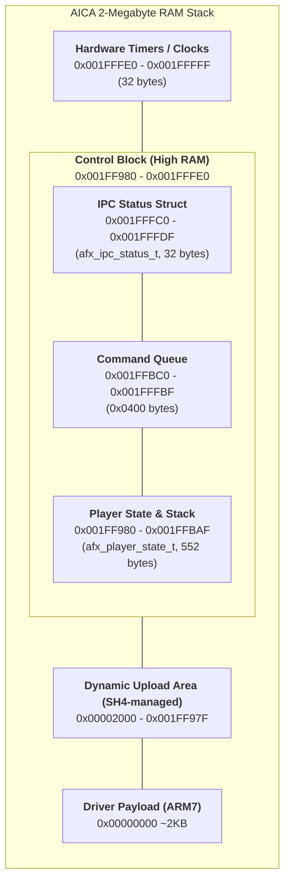

# .afx Format Design

## Core Philosophy

The ARM7 driver is a dumb stream player.
It does not do instrument logic, sample lookup, or synthesis decisions.

Driver responsibilities:
1. Advance virtual clock
2. When `virtual_clock >= flow_cmd.timestamp`, write `flow_cmd.value` to the target AICA register
3. Process SH4->ARM7 control commands from IPC queue

Host tool (`midi2afx`) responsibilities:
- Parse MIDI and resolve musical intent
- Select/pack samples and descriptors
- Encode AICA register command stream
- Bake per-note and per-voice decisions into flow commands

The result is a flow-command architecture where the runtime is deterministic and lightweight.

---


## Driver Memory Map (SPU RAM)

Current layout constants (from `include/afx/common.h` and `driver.h`):

- `AFX_MEM_CLOCKS = 0x001FFFE0`
- `AFX_IPC_STATUS_ADDR = 0x001FFFC0` (`sizeof(afx_ipc_status_t)=32`, aligned)
- `AFX_IPC_CMD_QUEUE_ADDR = 0x001FFBC0` (`AFX_IPC_QUEUE_SZ=0x0400`)
- `AFX_PLAYER_STATE_ADDR = 0x001FF980` (`sizeof(afx_player_state_t)=552`, aligned down to 32-byte boundary)

Addresses are derived by macros, not hardcoded constants:
- `AFX_IPC_STATUS_ADDR = ((AFX_MEM_CLOCKS - sizeof(afx_ipc_status_t)) & ~31)`
- `AFX_IPC_CMD_QUEUE_ADDR = (AFX_IPC_STATUS_ADDR - AFX_IPC_QUEUE_SZ)`
- `AFX_PLAYER_STATE_ADDR = ((AFX_IPC_CMD_QUEUE_ADDR - sizeof(afx_player_state_t)) & ~31)`

The SH4 side owns dynamic allocation in low/mid SPU RAM and uploads full `.afx` files. The ARM7 driver reads the uploaded header in-place and maintains runtime state in `afx_player_state_t` at a fixed high-memory address. This struct now includes a small reserved stack for the ARM7 compiler to use for local variables and spills, protected by a 32-bit canary.




## Binary Layout

```
[afx_header_t]             - 20-byte lean header
[afx_section_entry_t[]]    - implicit directory table (immediately follows header)
[FLOW]                     - array of afx_cmd_t
[SDES]                     - array of afx_sample_desc_t
[SDAT]                     - raw ADPCM/PCM bytes
```

All section offsets are relative to file start.

---

## Data Structures (Current)

### Header (`afx_header_t`)

```c
#define AICAF_MAGIC    0xA1CAF100
#define AICAF_VERSION  1

typedef struct {
    uint32_t magic;
    uint32_t version;
    uint32_t section_count;
    uint32_t total_ticks;      // total duration in ms
    uint32_t flags;
} afx_header_t;

/* Section table immediately follows header at offset 20 */
typedef struct {
    uint32_t id;               // AFX_SECT_* fourcc
    uint32_t offset;           // file-relative byte offset
    uint32_t size;             // bytes
    uint32_t count;            // entry count for array sections
    uint32_t align;            // alignment (4 or 32)
    uint32_t flags;
} afx_section_entry_t;
```

### Sample Descriptor (`afx_sample_desc_t`)

```c
#define AFX_FMT_PCM16  0
#define AFX_FMT_PCM8   1
#define AFX_FMT_ADPCM  3

#define AFX_LOOP_NONE  0
#define AFX_LOOP_FWD   1
#define AFX_LOOP_BIDIR 2

typedef struct {
    uint32_t source_id;
    uint8_t  gm_program;
    uint8_t  format;
    uint8_t  loop_mode;
    uint8_t  root_note;
    int8_t   fine_tune;
    uint8_t  reserved[3];
    uint32_t sample_off;   // byte offset into sample blob
    uint32_t sample_size;  // bytes
    uint32_t loop_start;   // byte offset relative to sample_off
    uint32_t loop_end;     // byte offset relative to sample_off
    uint32_t sample_rate;
} afx_sample_desc_t;
```

### Flow Command Entry (`afx_cmd_t`)

AFX v2 uses a variable-length command structure to support "burst" writes to consecutive AICA registers.

```c
typedef struct {
    uint32_t timestamp;     /* Absolute time in ms */
    struct {
      uint16_t slot : 6;    /* AICA voice slot (0-63) */
      uint16_t offset : 5;  /* Register offset (0-31) */
      uint16_t length : 5;  /* Number of consecutive 16-bit values (1-31) */
    };
    uint16_t values[];      /* Payload: length * 2 bytes */
} afx_cmd_t;
```

**Memory Layout:**
- **Header**: 6 bytes (4 bytes timestamp + 2 bytes packed metadata).
- **Payload**: `length * 2` bytes.
- **Alignment**: Every command is padded to a **4-byte boundary**. If `length` is odd (1, 3, 5...), 2 bytes of zero padding follow the payload.

**Example: Note-On Burst (18 bytes total)**
- `timestamp`: Current time
- `slot`: target voice
- `offset`: 0 (`AICA_REG_SA_HI`)
- `length`: 6
- `values`: [SA_HI, SA_LO, LSA, LEA, D2R_D1R, EGH_RR]
- *No padding needed (6 is even)*.

**Example: Single Value Update (12 bytes total)**
- `timestamp`: Current time
- `slot`: target voice
- `offset`: 13 (`AICA_REG_TOT_LVL`)
- `length`: 1
- `values`: [new_tl_volume]
- **Padding**: 2 bytes (to reach 4-byte alignment).

---

## AICA Register Command Targets

| Constant        | Value | AICA Register                         |
|----------------|-------|---------------------------------------|
| AICA_REG_CTL    | 0x00  | Control / KeyOn / KeyOff / format     |
| AICA_REG_SA_HI  | 0x01  | Sample address [23:16]                |
| AICA_REG_SA_LO  | 0x02  | Sample address [15:0]                 |
| AICA_REG_LSA_HI | 0x03  | Loop start [23:16]                    |
| AICA_REG_LSA_LO | 0x04  | Loop start [15:0]                     |
| AICA_REG_LEA_HI | 0x05  | Loop end [23:16]                      |
| AICA_REG_LEA_LO | 0x06  | Loop end [15:0]                       |
| AICA_REG_D2R_D1R| 0x07  | Decay 2 / Decay 1                     |
| AICA_REG_EGH_RR | 0x08  | EG hold / Release                     |
| AICA_REG_AR_SR  | 0x09  | Attack / Sustain                      |
| AICA_REG_LNK_DL | 0x0A  | Link / Decay level                    |
| AICA_REG_FNS_OCT| 0x0C  | Frequency / Octave                    |
| AICA_REG_TOT_LVL| 0x0D  | Total level                           |
| AICA_REG_PAN_VOL| 0x0E  | Pan / Volume                          |

---

## Runtime Offset Model

The driver keeps a single base pointer to the uploaded `.afx` file in AICA RAM (`afx_base`).
All offsets emitted by the preprocessor are file-relative and ARM7 resolves them at use time.

### Address Resolution Rule

For any file-relative value:

```c
absolute_spu_addr = afx_base + relative_offset;
```

### Runtime Behavior

**Initialization (PLAY time)**:
1. ARM7 stores the file base pointer in player state (`afx_base`)
2. ARM7 resolves known section pointers (for example, `FLOW`) using `afx_base + section.offset`

**Command Execution**:
- `SA_HI`/`SA_LO` command values are file-relative sample addresses
- ARM7 resolves the absolute sample address using `afx_base + cmd.value`
- High/low register fields are extracted from that resolved absolute address

### Runtime Fast Path Notes

- `afx_player_state_t` includes runtime scratch fields used by the ARM7 loop to minimize transient locals in hot paths.
- Queue tail wrap is fixed-size (`AFX_IPC_QUEUE_CAPACITY`), enabling constant-time ring behavior.
- `TOT_LVL` volume scaling is lookup-table based at runtime:
    - a 256-entry TL scale table is rebuilt only when volume changes
    - per-command `TOT_LVL` writes use direct table lookup (no multiply/divide in the hot write path)

### Why This Model

- No per-resource cache structure in runtime state
- No dependency on section-specific cached bases
- Uniform rule for all present and future file-relative resources

---

## SH4/ARM7 IPC Model

IPC transport is now a ring queue in AICA RAM.

Control/status block layout:
- `afx_ipc_status_t` (head/tail/status/tick/volume)
- command queue (`afx_ipc_cmd_t[]`)
- `afx_player_state_t`

Queue characteristics:
- fixed-size circular buffer
- SH4 is producer (`q_head`)
- ARM7 is consumer (`q_tail`)
- poll interval ~1ms, with drain-until-empty behavior

Supported commands:
- PLAY
- STOP
- PAUSE
- VOLUME
- SEEK

---

## SH4 Dynamic Memory Ownership (Current)

SH4 owns dynamic AICA RAM allocation.

Implemented host helpers:
- `afx_mem_reset`
- `afx_mem_alloc`
- `afx_mem_write`
- `afx_upload_afx`
- `afx_upload_and_init_firmware`

Firmware upload/init behavior:
- upload firmware at SPU address 0x0
- write 32-byte aligned dynamic-base marker immediately after firmware size
- clear queue/player/status control blocks
- initialize allocator cursor to computed dynamic base

---

## Family Playback Policies (Current)

Family policy metadata is generated into family map entries and consumed by converter.

Applied during conversion:
- note-off trim (`policy_note_trim_ms`) with min hold (`policy_min_hold_ms`)
- velocity shaping (`policy_velocity_gamma`, `policy_velocity_gain`)
- release-rate bias (`policy_release_bias`)

This affects flow-command generation, not driver complexity.

---

## What Has Been Done

1. Stable header/descriptor/stream schema implemented in code
2. DSP payload embedding and driver upload path implemented
3. Global runtime music volume scaling on TOT_LVL implemented (LUT fast path)
4. SH4-managed dynamic AICA upload helpers implemented
5. Firmware upload/init helper with dynamic-base marker implemented
6. IPC ring queue mechanism implemented (replacing single mailbox fields)
7. Queue resized to a compact practical default (`0x0400`)
8. Family patch workflow and policy-aware conversion implemented
9. Coverage reports for family patch mapping implemented

---

## What Still Needs To Be Done

1. Queue robustness instrumentation:
- optional overflow counter / dropped-command counter
- optional watermark metrics for tuning queue size on hardware

2. Queue API ergonomics:
- expose explicit success/failure return path to callers for enqueue operations
- optional timeout policy hooks on SH4 side

3. Emulator alignment:
- verify Python emulator behavior against latest queue/layout and policy changes
- add regression tests for seek + policy timing interactions

4. Documentation consolidation:
- sync README and this design doc whenever constants/struct fields change
- optionally auto-generate constant tables from headers

---

## Non-Goals (Still True)

- ARM7 does not perform instrument-bank decoding
- ARM7 does not do runtime pitch/envelope synthesis logic
- ARM7 does not run an interpreted script VM
- Runtime stays a timestamped register-command sequencer
