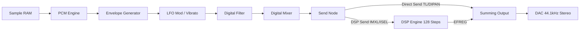

# AICA Sound Processor: Technical Reference

This document is the consolidated, exhaustive reference for the Yamaha AICA sound processor used in the Sega Dreamcast. It combines all known hardware specifications, register layouts, DSP architecture, and emulator reverse-engineering into a single source of truth for low-level firmware development.

---

## 1. System Architecture Overview

The AICA sound subsystem is a complete audio workstation on a chip, featuring a dedicated ARM7 controller, a PCM playback engine, and a programmable DSP.

### 1.1 Hardware Blocks & Features
- **Main CPU**: Hitachi SH4 @ 200MHz. Connects to AICA via G2 Bus.
- **Control CPU**: ARM7DI @ ~45MHz (Internal to AICA).
- **PCM Engine**: 64 hardware voices (slots).
- **Sample Formats**: 16-bit PCM, 8-bit PCM, 4-bit Yamaha ADPCM.
- **Sample Rate**: 44.1 kHz fixed output.
- **Wave RAM**: 2MB SDRAM standard (expandable up to 8MB). Shared between ARM7, DSP, and PCM Engine.
- **DSP Engine**: 128-step programmable microprogram for effects.
- **Modulators**: Hardware Envelope Generator (EG), Pitch Generator (PG), Low Frequency Oscillator (LFO), and Digital Controlled Filter (DCF).

---

## 2. Memory Map & Registers

The AICA space is mapped directly for the ARM7, and usually visible to the SH4 via G2 bus offset (e.g., `0xA0800000`).

### 2.1 Top-Level Memory Map
| Address Range | Description | Size |
| :--- | :--- | :--- |
| `0x00000000 - 0x007FFFFF` | **Wave RAM**: Sample data, driver code, pattern data. | 8MB (Max) |
| `0x00800000 - 0x00801FFF` | **Channel Registers**: Slots 0-63. | 64 × 0x80 bytes |
| `0x00802000 - 0x008027FF` | **Common Regs**: Timers, master volume. | 2KB |
| `0x00802800 - 0x00802FFF` | **IRQ/Common**: IRQ control and status. | 2KB |
| `0x00803000 - 0x00807FFF` | **DSP Regs**: MPRO, COEF, MADRS, TEMP, etc. | 20KB |

### 2.2 Detailed DSP Register Bases
| Address | Register | Size / Scope | Description |
| :--- | :--- | :--- | :--- |
| `0x00803000` | **COEF** | 128 × 13-bit | Multiplier coeff values (1.0 = `0x4000`, Q14). Lower 3 bits must be written as `0` for compatibility. |
| `0x00803200` | **MADRS** | 64 × 16-bit | Memory addresses for DSP instructions. |
| `0x00803400` | **MPRO** | 128 × 64-bit | DSP Microprogram. |
| `0x00804000` | **TEMP** | 128 × 24-bit | DSP work buffer (Ring buffer, auto-decrements). |
| `0x00804400` | **MEMS** | 32 × 24-bit | Sound memory input buffer. |
| `0x00804500` | **MIXS** | 16 × 20-bit | Input mixer buffer (summed sound sources). |
| `0x00804580` | **EFREG** | 16 × 16-bit | DSP output buffer. |
| `0x008045C0` | **EXTS** | 2 entries | External audio input. |

### 2.3 RAM Layout Guidance
AICA Wave RAM does not enforce a fixed partition policy. Any layout is valid as long as code/data regions do not overlap and register-visible addresses remain within range.

Generic guidance:
- Keep ARM7 firmware and exception/stack area in a stable low-memory region.
- Keep control/IPC metadata in a reserved high-memory block for deterministic host/driver coordination.
- Use the remaining range as a data region for sample banks, sequence/command streams, and runtime uploads.

Project suggestion (AICAFlow layout):
- `0x001FFFE0 - 0x001FFFFF`: clock/timer mirror block (`AFX_MEM_CLOCKS`).
- `0x001FFFC0 - 0x001FFFDF`: IPC status (`AFX_IPC_STATUS_ADDR`).
- `0x001FFBC0 - 0x001FFFBF`: SH4->ARM7 ring queue (`AFX_IPC_CMD_QUEUE_ADDR`, `0x0400` bytes).
- `0x001FFA60 - 0x001FFBB3`: driver runtime state (`AFX_DRIVER_STATE_ADDR`, `sizeof(afx_driver_state_t)=268`).
- `0x00002000 - 0x001FFA5F`: SH4-managed dynamic upload area (full `.afx` payloads uploaded in-place).
- `0x00000000 - 0x00001FFF`: ARM7 firmware payload + startup data.

Note: these addresses are macro-derived from structure sizes and 32-byte alignment in `include/afx/driver.h`.

Samples should be aligned to at least 32-bit boundaries. ADPCM typically reduces sample footprint by about 50% compared to PCM16, with encode-side complexity and hardware decode at playback.

---

## 3. Sound Slot (Channel) Architecture

Each of the 64 slots occupies `0x80` bytes.

Slot N base address:
```c
#define AICA_REG_BASE        0x00800000
#define AICA_CHANNEL_OFFSET  0x80
#define AICA_CHANNEL(n) \
    ((aica_slot_t*)(AICA_REG_BASE + (n) * AICA_CHANNEL_OFFSET))
```

Slot address examples:
```
Slot 0  -> 0x00800000
Slot 1  -> 0x00800080
...
Slot 63 -> 0x00801F80
```

### 3.1 Slot Register Offset Layout
Project code uses a packed command payload overlay (`aica_chnl_packed_t`) to represent slot register words inside `aica_cmd_t` / flow command data.

Important model note:
- The `Offset` column below refers to AICA slot register offsets in the hardware map (`0x00`, `0x04`, ...).
- Each row is one 16-bit payload word carried in the command stream.
- The ARM driver unpacks these payload words into 32-bit MMIO writes to the slot register addresses.
- For these writes, only the low 16 bits are semantically used by this command format.
- Hardware slot stride is still `0x80` bytes per channel.

| Offset | Register | Packed member | Bitfield slices (MSB -> LSB, 15..0) |
| :--- | :--- | :--- | :--- |
| `0x00` | Play Control | `play_ctrl.raw` | `[15] key_on_ex &#124; [14] key_on &#124; [13:11] reserved &#124; [10] ssctl &#124; [9] lpctl &#124; [8:7] pcms &#124; [6:0] sa_high` |
| `0x04` | Sample Address Low | `sa_low` | `[15:0] sa_low` |
| `0x08` | Loop Start | `lsa` | `[15:0] lsa` |
| `0x0C` | Loop End | `lea` | `[15:0] lea` |
| `0x10` | Env Attack/Decay | `env_ad.raw` | `[15:11] d2r &#124; [10:6] d1r &#124; [5] reserved1 &#124; [4:0] ar` |
| `0x14` | Env Release/Sustain | `env_dr.raw` | `[15] reserved &#124; [14] lpslnk &#124; [13:10] krs &#124; [9:5] dl &#124; [4:0] rr` |
| `0x18` | Pitch | `pitch.raw` | `[15] reserved2 &#124; [14:11] oct &#124; [10] reserved1 &#124; [9:0] fns` |
| `0x1C` | LFO | `lfo.raw` | `[15] lfore &#124; [14:10] lfof &#124; [9:8] plfows &#124; [7:5] plfos &#124; [4:3] alfows &#124; [2:0] alfos` |
| `0x20` | Env/FM Send | `env_fm.raw` | `[15:13] reserved2 &#124; [12:5] tl &#124; [4:1] isel &#124; [0] reserved1` |
| `0x24` | Pan/Direct Send | `pan.raw` | `[15:12] imxl &#124; [11:8] disdl &#124; [7:5] reserved &#124; [4:0] dipan` |
| `0x28` | Resonance | `resonance.raw` | `[15:5] reserved &#124; [4:0] q` |
| `0x2C` | Filter Level 0 | `flv0` | `[15:14] reserved &#124; [13:0] flv0` |
| `0x30` | Filter Level 1 | `flv1` | `[15:14] reserved &#124; [13:0] flv1` |
| `0x34` | Filter Level 2 | `flv2` | `[15:14] reserved &#124; [13:0] flv2` |
| `0x38` | Filter Level 3 | `flv3` | `[15:14] reserved &#124; [13:0] flv3` |
| `0x3C` | Filter Level 4 | `flv4` | `[15:14] reserved &#124; [13:0] flv4` |
| `0x40` | FEG Attack/Decay1 | `env_feg.raw` | `[15:11] fd1r &#124; [10:8] reserved2 &#124; [7:3] far &#124; [2:0] reserved1` |
| `0x44` | FEG Decay2/Release | `env_feg2.raw` | `[15:11] frr &#124; [10:8] reserved2 &#124; [7:3] fd2r &#124; [2:0] reserved1` |

Recommended technical-reference notes for this packed overlay:
- `aica_chnl_packed_t` documents 18 command payload words (16-bit each) that target register offsets `0x00` through `0x44`.
- It is not a full in-memory image of all `0x80` bytes in a hardware slot.
- Keep `volatile` on the memory-mapped pointer, not on the typedef itself.
- Packed bitfield layout is implementation-defined. This mapping assumes little-endian GCC/Clang ARM bitfield ordering (the project toolchain).
- Preserve `raw` access for deterministic register writes when compiler bitfield packing may differ.
- Add ABI guards in code: `sizeof(aica_chnl_packed_t) == 0x24` and critical `offsetof(...)` checks for each payload word.
- `flv0..flv4` are 14-bit filter-level points (attack start/end, decay end, key-off point, release target), with upper 2 bits reserved.
- `env_feg`/`env_feg2` provide FEG rates: `far`, `fd1r`, `fd2r`, `frr`.

FLV phase quick map:

| Payload word | Offset | Envelope moment | Description |
| :--- | :--- | :--- | :--- |
| `flv0` | `0x2C` | Attack start | Initial cutoff level when note starts. |
| `flv1` | `0x30` | Attack end / Decay-1 start | Cutoff at transition from attack to decay. |
| `flv2` | `0x34` | Decay end / Sustain start | Cutoff as note enters sustain region. |
| `flv3` | `0x38` | Key-off | Cutoff captured at note release trigger. |
| `flv4` | `0x3C` | Post-release target | Final cutoff target after release completes. |

Example payload construction (later unpacked by ARM into 32-bit MMIO writes):
```c
volatile aica_chnl_packed_t cmd = {0};

cmd.play_ctrl.bits.sa_high = (addr >> 16) & 0x7F;
cmd.sa_low = addr & 0xFFFF;
cmd.play_ctrl.bits.key_on_ex = 1;
cmd.play_ctrl.bits.key_on = 1;
```

### 3.2 Playback Control (`play_ctrl` PCMS & Key Control)
- **Bits 0–6**: `SA[22:16]` - Sample address bits 16–22.
- **Bits 7–8**: Audio Format (`PCMS[1:0]`).
  - `0`: 16-bit PCM (signed). *Must be Word Aligned (SA0 = 0)*
  - `1`: 8-bit PCM (signed).
  - `2`: 4-bit Yamaha ADPCM.
  - `3`: 4-bit Streaming ADPCM for continuous buffers.
- **Bit 9**: Loop Enable (`LPCTL`). (`0` = no loop, `1` = forward loop).
- **Bit 14**: Key Off.
- **Bit 15**: Key On.

**Sample Address Composition**: The full 23-bit sample address is formed by combining bits from the `play_ctrl` payload word and `sa_low`:
```
FullAddress = (play_ctrl.sa_high << 16) | sa_low
```
This gives `SA[22:0]`, the byte address in Wave RAM. PCM16 requires `SA0 = 0` (word alignment).

**Loop Addresses**: `LSA` (Loop Start) and `LEA` (Loop End) are relative to the sample start address.

### 3.3 Pitch Formula and Calculation
Pitch merges two fields: `OCT` (signed octave, 4-bit) and `FNS` (fine step, 12-bit).
$$P = 1200 \times \log_2\left(\frac{2^{10} + FNS}{2^{10}}\right)$$
*   **OCT ($+7$ to $-8$)**: Coarse pitch.
*   **FNS ($0$ to $4095$)**: Fine resolution (~1.69 cents per step).

**Register encoding**:
```c
pitch = (oct << 12) | fns;
```
*Tip*: Precompute a note→(OCT, FNS) lookup table for tracker efficiency.

### 3.4 Envelope Generator (AEG)
A 4-stage hardware envelope that shapes how a note's volume evolves over time — from the initial percussive hit to the lingering tail after release:
- **AR**: Attack Rate (0-31). Controls how fast the sound reaches full volume after key-on. Low values produce a slow, gradual swell (like a bowed string or pad). High values produce an instant, snappy onset (like a drum hit or pluck).
- **D1R/D2R**: Decay 1/2 Rates. D1R controls the initial fade from peak to the Decay Level — this is the bright "ting" that quickly dies away on a struck bell or piano. D2R acts as a sustain rate: it defines whether the held note gently fades (like a natural piano sustain) or stays perfectly steady (like an organ).
- **RR**: Release Rate. How quickly the sound fades to silence after key-off. Short release gives a tight, clipped stop. Long release gives a reverberant, lingering tail.
- **DL**: Decay Level. The volume plateau between D1R and D2R. A high DL means the sound stays loud after the initial transient; a low DL creates a dramatic drop-off after the attack, giving a plucked or percussive character.
- **KRS**: Key Rate Scaling (scales envelope speed with pitch). Mimics how real instruments behave: higher notes decay faster than lower ones (think how a high piano note rings briefly while a bass note sustains for seconds).

### 3.5 LFO & DCF (Hardware Effects)
- **LFO**: Independent per slot. Modulates Pitch (`PLFOS`) or Amplitude (`ALFOS`). Features Triangle, Saw, Square, and Noise waveforms (`LFOF`, `PLFOWS`, `ALFOWS`).
  - *Pitch LFO (Vibrato)*: A gentle wobble in pitch, like a singer's natural voice quiver or a guitarist bending a string back and forth. Triangle wave gives a smooth, musical vibrato. Square wave gives a jarring trill between two pitches. Saw gives a rising-then-dropping pitch "scoop." Noise gives an unstable, detuned quality — useful for lo-fi or distorted textures.
  - *Amplitude LFO (Tremolo)*: A rhythmic pulsing of volume, like a guitarist's tremolo picking or a Leslie speaker's swelling rotation. Slow rates feel like breathing or gentle throbbing. Fast rates create a stuttering, machine-gun flutter.
- **DCF (Digital Filter)**: Resonance (`Q`) and dynamic envelope targeting (`FLV0-FLV4`). The filter controls the brightness/darkness of the tone. A low-pass filter with high cutoff sounds bright and open; sweeping the cutoff down makes the sound go progressively duller and more muffled — like hearing music through a closing door. High resonance (`Q`) adds a sharp, whistling peak at the cutoff frequency, creating the classic "wah" or synth sweep sound. The filter envelope (`FLV0-FLV4`) lets you animate this automatically: a fast envelope sweep from bright to dark on each note gives a funky "bwow" bass; a slow sweep gives evolving pad textures.
- **Modulation Sources & Precision**: For DSP modulation, three primary sources can provide waveforms:
  - CPU-written waves via **`COEF`** (13-bit precision)
  - Slot mixer outputs via **`MIXS`** (16-bit precision)
  - Dedicated buffers via **`MEMS`** (24-bit precision)

Resonance (`Q`) code-to-gain quick reference:

| Q bits | Gain (dB) | Q bits | Gain (dB) |
| :--- | :--- | :--- | :--- |
| `11111` | `20.25` | `00100` | `0.00` |
| `11100` | `18.00` | `00011` | `-0.75` |
| `11000` | `15.00` | `00010` | `-1.50` |
| `10000` | `9.00` | `00001` | `-2.25` |
| `01100` | `6.00` | `00000` | `-3.00` |
| `01000` | `3.00` |  |  |
| `00110` | `1.50` |  |  |

### 3.6 Volume & Panning
- **TL**: Total Level. Logarithmic attenuation scale. Typical conversion from linear tracker volume: `TL = (64 - volume) * 4`.
- **DIPAN**: Direct Pan (5-bit signed, center ≈ `0x0F`).
- **DISDL**: Direct Send Level.
- **DSP Sending**: `IMXL` (Input mix level) and `ISEL` (DSP input routing index, selects which of the 16 `MIXS` buses to target).
- **DSP Return Routing**: `EFSDL` (Effect Send Level from DSP output back to mixer) and `EFPAN` (Effect Pan for stereo positioning of the DSP return).

**Register construction**:
```c
pan_vol = (pan & 0x1F) | (volume << 8);
```

---

## 4. Hardware Signal Flow



---

## 5. Programming the Engine & Slots

### 5.1 Simple Trigger Sequence & Synchronous Key-On
**Standard Notes**:
1. Set `KEYOFF` (`play_ctrl` Bit 14 = 0).
2. Write addresses, pitch, pan, and envelope to registers. `LEA` (Loop End Address) cannot be set to `0xFFFF`.
3. Set `KEYON` (`play_ctrl` Bit 15 = 1).

**Synchronous Key-On (`KYONB` / `KYONEX`)**:
For triggering chord notes across multiple slots with exactly 0 latency:
1. Set the target slot bits in the `KYONB` registers.
2. Write `1` to the `KYONEX` register. This simultaneously activates the playback of all flagged slots.

**C Implementation Example:**
```c
#define AICA_BASE 0x00800000
#define SLOT_SIZE 0x80

void play_sample(int ch, uint32_t addr, uint32_t loop_start, uint32_t loop_end,
                 uint32_t format, uint32_t pitch, uint8_t volume, uint8_t pan) {
    volatile uint32_t *slot = (volatile uint32_t*)(AICA_BASE + (ch * SLOT_SIZE));

    slot[0] = (1 << 14); // KEYOFF
    
    uint32_t addr_hi = (addr >> 16) & 0x7F;
    slot[0] = addr_hi | (format << 7) | ((loop_start != loop_end) ? (1<<9) : 0);
    slot[1] = addr & 0xFFFF;
    slot[2] = loop_start;
    slot[3] = loop_end;

    slot[4] = (0x1F << 8) | 0x1F; // AR/D1R (Hardcoded instant in this example)
    slot[6] = pitch;
    slot[9] = (pan & 0x1F) | (volume << 8); // simplified pan/vol mapping
    
    slot[0] |= (1 << 15); // KEYON
}

void set_vibrato(int ch) {
    volatile uint32_t *s = (volatile uint32_t*)(AICA_BASE + (ch * SLOT_SIZE));
    uint32_t lfo = 0;
    lfo |= (4 << 0);   // LFOF frequency
    lfo |= (1 << 8);   // pitch waveform
    lfo |= (4 << 12);  // pitch depth
    s[7] = lfo;
}
```

### 5.2 Control-Loop Mapping Pattern (Implementation Example)

This section describes a common firmware strategy, not an AICA hardware requirement.
A timer-driven loop can parse tracker rows or flow-command events on ARM7 and emit register updates incrementally.
Avoid memory copies inside interrupt handlers; keep ISR work bounded and update slot/common registers directly.

| MOD/XM Tracker Effect | Native AICA Hardware Feature | What It Sounds Like |
| :--- | :--- | :--- |
| **Volume Slide** | `TL` (Total Level) register adjustment. | A gradual fade-in or fade-out of the note — like turning a volume knob smoothly up or down. Used for swells, crescendos, and gentle note exits. |
| **Vibrato** | Hardware `PLFO` (Pitch LFO) & `PLFOS`. | A shimmering, singing wobble in pitch — the warmth a violinist adds with their fingertip, or the natural quiver in a sustained vocal note. Gives life and expressiveness to otherwise static tones. |
| **Tremolo** | Hardware `ALFO` (Amplitude LFO) & `ALFOS`. | A rhythmic pulsing of loudness — like a mandolin tremolo or the throbbing of a Leslie speaker cabinet. Creates intensity and movement without changing pitch. |
| **Portamento** | `FNS` (Fine Step) slide over ticks. | A smooth, continuous pitch glide from one note to another — like a trombone slide or a finger sliding up a guitar string. The note "bends" audibly between pitches instead of jumping. |
| **Arpeggio** | Rapid `OCT` + `FNS` register cycling over ticks. | A rapid-fire flickering between multiple notes in a chord, creating the illusion of a strummed chord from a single channel — the signature "chiptune shimmer" of classic tracker music. At high speed it sounds like a buzzy chord; slower, like a harp glissando. |
| **Envelopes (ADSR)**| `AR/D1R/D2R/RR` and `DL` registers (No polling needed!). | Shapes the entire life arc of a note: the initial punch of a drum hit (attack), the bright ring that fades (decay), the steady held tone (sustain), and the tail that lingers after release. Without envelopes, every note is a flat, lifeless rectangle of sound. |

---

## 6. DSP Microprogramming

### 6.1 DSP Characteristics and Limits
- **Instructions**: Maximum 128 instructions. No conditional branching.
- **Execution**: 128 instructions run exactly once per sample @ 44.1 kHz (approx. ~5.6M DSP ops/sec).
- **Execution Timing & Collision**: The DSP and PCM Engine interweave memory access step by step for efficiency.
  | Step Time | Engine Accessing Memory |
  | :--- | :--- |
  | `T0 / T1` | DSP Memory Read |
  | `T2 / T3` | PCM Engine Memory Access |
  | `T4 / T5` | DSP Memory Read |
  | `T6 / T7` | PCM Engine Memory Access |
  *Collision Warning*: DSP memory access must therefore occur in **odd steps**, as any read/write on even steps risks colliding with the active PCM data fetch routines.
- **Control Control Model**: Disable DSP completely -> Upload 128 instructions -> Upload Coefficients (`COEF`, lower 3 bits `0`) -> Configure `MADRS` -> Enable DSP.

### 6.2 The TEMP Buffer
- **TEMP** acts as a working ring buffer (128 entries of 24-bits). 
- **Critical Feature:** The `TEMP` pointer *decrements automatically each sample*. This creates hardware-native feedback / delay lines with zero overhead.

### 6.3 Instruction Encoding (Reverse Engineered)
The manual lists ~55 valid bits for a 64-bit word. Flycast & MAME reveal the specific packed layout:

```text
63                                                             0
+----+----+----+----+----+----+----+----+----+----+----+----+----+
|TRA |TWT |TWA |XSEL|YSEL|IRA |IWT |IWA |TABLE|MWT |MRD |ADRL|SHIFT|
+----+----+----+----+----+----+----+----+----+----+----+----+----+
```
- **[63:57] `TRA`**: TEMP read address.
- **[56] `TWT`**: TEMP write enable.
- **[55:49] `TWA`**: TEMP write address.
- **[48:47] `XSEL`**: X input select.
- **[46:45] `YSEL`**: Y multiplier source (`00`: FRC_REG, `01`: COEF, `10`: Y_REG[23:11], `11`: Y_REG[15:4]).
- **[44:39] `IRA`**: INPUTS read address (`00-1F`: MEMS. `20-2F`: MIXS slot inputs. `30/31`: EXTS Left/Right).
- **[38] `IWT`**: INPUT write enable.
- **[37:33] `IWA`**: INPUT write address.
- **[32:27] `MASA`**: MADRS address table read.
- **[26] `BSEL`**: Choose accumulator or TEMP.
- **[25] `ZERO`**: Force adder input to zero.
- **[24] `NEGB`**: Subtract instead of add.
- **[23] `YRL`**: Latch Y register.
- **[22:19] `EWA`**: EFREG output address.
- **[18] `EWT`**: Write result to EFREG.

*Collision Warning*: DSP memory access must occur in **odd steps**. Even steps collide with PCM engine fetching.

### 6.4 Basic DSP Effect Architectures
Because the `TEMP` pointer automatically loops/decreases matching the sample rate (1.0 index = 1 sample), generating classic audio modulations relies purely on multiplier feedback routing.

**1. Delay / Echo**
A time-delayed copy of the signal mixed back in.
*What it sounds like*: A distinct repetition of the original sound, like shouting into a canyon and hearing your voice bounce back. Short delays (< 50ms) create a "slapback" doubling effect common in rockabilly vocals. Longer delays produce clearly separated echoes. With feedback, echoes repeat and gradually fade — like a bouncing ball coming to rest.
1.  Sample enters `MIXS[0]` -> Add `MIXS` input to Accumulator.
2.  Read `TEMP` at the delay offset.
3.  Multiply by `COEF` (feedback/decay amount).
4.  Mix back into signal.
5.  Write result to `TEMP`.
6.  Push to `EFREG` for output.

**2. Reverb**
Multiple overlapping delay lines with cross-feedback, simulating the dense reflections of a physical room.
*What it sounds like*: The ambient wash that makes a sound feel like it exists in a space — from a tiled bathroom's bright, ringy shimmer to a cathedral's vast, slowly-decaying warmth. Without reverb, sounds feel "dry" and unnaturally close, like wearing headphones in an anechoic chamber. With heavy reverb, notes blur together into a lush, ethereal haze. Short reverb times sound like a small room; long times sound like a concert hall.
- Implemented as 3-4 cascaded delay lines in `TEMP` with different prime-number lengths and cross-coupled `COEF` feedback gains (typically 0.3–0.7).

**3. Chorus**
*What it sounds like*: A shimmering, widened version of the original sound — as if multiple copies are playing in near-unison but slightly detuned and time-shifted, like a choir where no two singers are perfectly synchronized. Adds richness, depth, and a liquid "swimmy" quality. On guitars it creates the classic 80s clean tone. On pads and strings it adds lush movement and stereo width.
- Requires modulated delay buffer pointer. Similar logic to Reverb, but pushes an active oscillation parameter from LFO/`COEF` modulation over the delay length. Uses `MASA` (MADRS) address offset mapping dynamically to sweep the read position.

**4. Flanger**
*What it sounds like*: A sweeping, jet-engine "whoosh" that moves through the frequency spectrum — like a comb being dragged across the harmonics. More metallic and dramatic than chorus. At extreme settings, it creates a hollow, robotic, "underwater" quality. Named after the original technique of pressing a finger against a tape reel flange.
- Very short modulated delay line (1-10ms) mixed with the dry signal, creating comb filter interference patterns that sweep as the delay time oscillates.

**5. Low-Pass Filter (LPF)**
*What it sounds like*: Progressively removes high frequencies, making the sound darker and more muffled — like putting a blanket over a speaker, or hearing music from the next room through a wall. Sweeping the cutoff creates the iconic "wah" or synth filter sweep.
- Uses `COEF` multipliers to implement a difference equation on consecutive `TEMP` samples.

**6. Distortion / Saturation**
*What it sounds like*: Adds grit, crunch, and harmonic overtones by clipping the signal — from subtle warmth (like a tube amp quietly overdriven) to aggressive, buzzy fuzz (like a distortion guitar pedal). Soft clipping rounds off peaks gently; hard clipping creates a harsh, square-wave buzz.
- Achieved by driving the accumulator past its 24-bit saturation point. High `COEF` gain intentionally overflows the signal, and the hardware's saturating arithmetic naturally clips the peaks.

**7. Parametric EQ / Shelving**
*What it sounds like*: Boosts or cuts specific frequency ranges — like turning the bass and treble knobs on a stereo. A bass boost adds warmth and thump; a treble boost adds sparkle and air; a mid cut scoops out the "boxy" quality. Used for tonal shaping and making instruments sit together in a mix.
- Implemented with cascaded `COEF` multiply-accumulate stages forming biquad filter topologies.

**8. Compressor / Limiter (Software-Assisted)**
*What it sounds like*: Evens out the dynamic range — quiet parts get louder, loud parts get quieter. Makes everything sound more "present" and punchy, like the difference between a whispered conversation and a radio broadcast. Heavy compression gives the "pumping" effect heard in electronic dance music sidechaining.
- Typically requires ARM7 intervention to analyze peak levels and dynamically adjust `COEF` gain values, as the DSP has no conditional branching.

### 6.5 Example MPRO Instruction Assembler (C)
To assemble `MPRO` pseudo-ops into bit-perfect Katana `0x00803400` upload blocks:
```c
typedef struct { uint8_t TRA, TWT, TWA, XSEL, YSEL, IRA, IWT, IWA, MASA, BSEL, ZERO, NEGB, YRL, EWA, EWT; } AICADSPInstr;

uint64_t assemble(AICADSPInstr i) {
    uint64_t op = 0;
    op |= ((uint64_t)(i.TRA & 0x7F)) << 57;  op |= ((uint64_t)(i.TWT & 1)) << 56;
    op |= ((uint64_t)(i.TWA & 0x7F)) << 49;  op |= ((uint64_t)(i.XSEL & 3)) << 47;
    op |= ((uint64_t)(i.YSEL & 3)) << 45;    op |= ((uint64_t)(i.IRA & 0x3F)) << 39;
    op |= ((uint64_t)(i.IWT & 1)) << 38;     op |= ((uint64_t)(i.IWA & 0x1F)) << 33;
    op |= ((uint64_t)(i.MASA & 0x3F)) << 27; op |= ((uint64_t)(i.BSEL & 1)) << 26;
    op |= ((uint64_t)(i.ZERO & 1)) << 25;    op |= ((uint64_t)(i.NEGB & 1)) << 24;
    op |= ((uint64_t)(i.YRL & 1)) << 23;     op |= ((uint64_t)(i.EWA & 0xF)) << 19;
    op |= ((uint64_t)(i.EWT & 1)) << 18;
    return op;
}
```
*Note*: Emulators and SDKs write `MPRO` using four 16-bit blocks mapping the `uint64_t` over consecutive `0x00803400` offsets.

---


---

# 6.6 DSP Accumulator & Arithmetic (Critical Behavior)

- Internal accumulator is wider than 24-bit (≈26–27 bits)
- Arithmetic is **saturating (not wrapping)**

Core operation:
ACC = saturate(ACC ± (X * Y))

Multiplier:
24-bit × 13-bit → extended precision → truncated → ACC

Implications:
- Enables natural distortion / saturation
- Affects filter stability
- Critical for accurate emulation

---

# 6.7 Y Register Pipeline Behavior

- DSP uses a **latched Y register**
- Controlled by `YRL`

Pipeline timing:

Step N:
  if (YRL) Y ← new value

Step N+1:
  MUL uses latched Y

This introduces a **1-step latency** in multiplier behavior.

---

# 6.8 X Input Selection (XSEL)

Typical mapping:

XSEL:
  0 = TEMP[TRA]
  1 = INPUT (IRA)
  2 = ACC (feedback)
  3 = ZERO

---

# 6.9 MADRS / MASA (Indirect Addressing)

MADRS is a lookup table used for dynamic addressing:

addr = MADRS[MASA] + offset

Used for:
- Chorus
- Flanger
- Modulated delay

---

# 6.10 TEMP Ring Buffer Semantics

- 128-entry circular buffer
- Pointer auto-decrements each sample
- Wraps with mask &0x7F

Access model:
TEMP[(base - delay) & 0x7F]

This is the foundation of all delay-based DSP effects.

---

# 6.11 EFREG Output Behavior

- 16-bit signed output
- Derived from ACC with scaling

EFREG = clamp16(ACC >> shift)

---

# 6.12 MIXS Accumulation

MIXS[n] = sum(slot outputs × IMXL scaling)

- Updated before DSP runs each sample
- Provides DSP input signals

---

# 6.13 Safe DSP Upload Sequence

1. Disable DSP
2. Wait ≥ 1 sample
3. Upload MPRO
4. Upload COEF
5. Upload MADRS
6. Enable DSP

---

# 6.14 Minimal Working DSP Program (Echo)

Pseudo-assembly:

STEP 0: READ MIXS0
STEP 1: READ TEMP0
STEP 2: MUL COEF0
STEP 3: ADD ACC
STEP 4: WRITE TEMP0
STEP 5: WRITE EFREG0

Remaining steps = NOP

---

# 6.15 Execution Pipeline

INPUT → XSEL → MUL(Y) → ADD → ACC → TEMP/EFREG

---

# 6.16 Step Timing (Simplified)

Per step:
- Fetch instruction
- Latch Y (if YRL)
- Multiply
- Add/Subtract
- Writeback

# 6.17 AICA DSP 128-Step Reverb Program (Sega-style)

## Coefficients (Q14)

```
COEF0 = 0x3000 ; 0.75 feedback
COEF1 = 0x2000 ; 0.5 feedback
COEF2 = 0x1000 ; 0.25 diffusion
COEF3 = 0x0800 ; 0.125 diffusion
```


## DSP Program
```
STEP 0: READ MIXS0
STEP 1: READ TEMP16 MUL COEF1 ADD ACC
STEP 2: READ TEMP32 MUL COEF2 ADD ACC
STEP 3: READ TEMP48 MUL COEF3 ADD ACC
STEP 4: WRITE TEMP64
STEP 5: WRITE TEMP80
STEP 6: WRITE TEMP96
STEP 7: READ TEMP96 MUL COEF3 ADD ACC
STEP 8: READ TEMP0 MUL COEF0 ADD ACC
STEP 9: WRITE EFREG0
STEP 10: WRITE EFREG1
STEP 11: NOP
STEP 12: NOP
...
STEP 126: NOP
STEP 127: NOP
```
